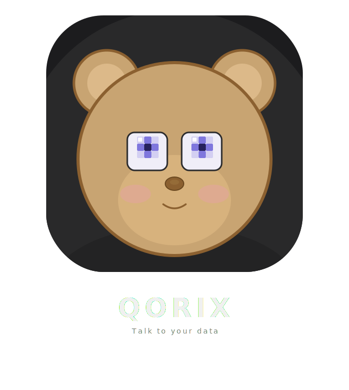

<p align="center">
  
</p>

<h1 align="center">Qorix</h1>

<p align="center">
  <strong>AI-powered developer toolkit for REST APIs, SQL, and NoSQL</strong>
</p>

<p align="center">
  <a href="https://github.com/ansxuman/QoriX/blob/main/LICENSE"></a>
  <a href="https://github.com/ansxuman/QoriX/stargazers"></a>
  <a href="https://github.com/ansxuman/QoriX/issues"></a>
  <a href="https://github.com/ansxuman/QoriX/releases/latest"></a>
</p>

<p align="center">
  <a href="https://qorix.ssh-i.in">Website</a> ·
  <a href="https://qorix.ssh-i.in/changelog">Changelog</a> ·
  <a href="https://github.com/ansxuman/QoriX/issues">Report Bug</a> ·
  <a href="https://github.com/ansxuman/QoriX/issues">Request Feature</a>
</p>

---

## Features

- **REST API Client** — Build, test, and organize API requests with collections, environments, and variable substitution
- **AI Assistant** — Describe what you want in plain English and let AI generate requests, queries, and filters
- **Environment Management** — Global and per-collection environments with secret masking and `{{variable}}` autocomplete
- **GitHub Gist Sync** — Sync collections, environments, and settings across devices via private GitHub Gists
- **Native macOS Experience** — Built with Tauri and Rust for a fast, lightweight, native feel with vibrancy/glass effects
- **JSON Syntax Highlighting** — Color-coded body editor with format, line numbers, and validation
- **Request History** — Automatic logging of every executed request with status, timing, and response
- **Keyboard-First** — Full keyboard shortcut support (Cmd+Enter, Cmd+I, Cmd+B, Cmd+1/2/3)

## Download

<p>
  <a href="https://github.com/ansxuman/QoriX/releases/latest"><strong>Download for macOS →</strong></a>
</p>

> Windows and Linux support coming soon.

## Development

### Prerequisites

- [Bun](https://bun.sh) (latest)
- [Rust](https://rustup.rs) (1.77+)
- [Tauri CLI](https://tauri.app) v2

### Setup

```bash
# Clone the repository
git clone https://github.com/ansxuman/QoriX.git
cd QoriX

# Install dependencies
bun install

# Run in development mode
bun run tauri dev

# Build for production
bun run tauri build
```

## Tech Stack

| Layer | Technology |
|-------|-----------|
| Frontend | SvelteKit + Svelte 5 + TypeScript |
| Backend | Rust + Tauri v2 |
| Database | SQLite (sqlx) |
| HTTP | reqwest |
| Auth | GitHub OAuth + OS Keychain |
| Package Manager | Bun |

## Contributing

Contributions are welcome! Please read the [Contributing Guide](.github/CONTRIBUTING.md) before submitting a pull request.

## Support

<a href="https://www.buymeacoffee.com/ansxuman" target="_blank"></a>

## License

[Business Source License 1.1](LICENSE)
