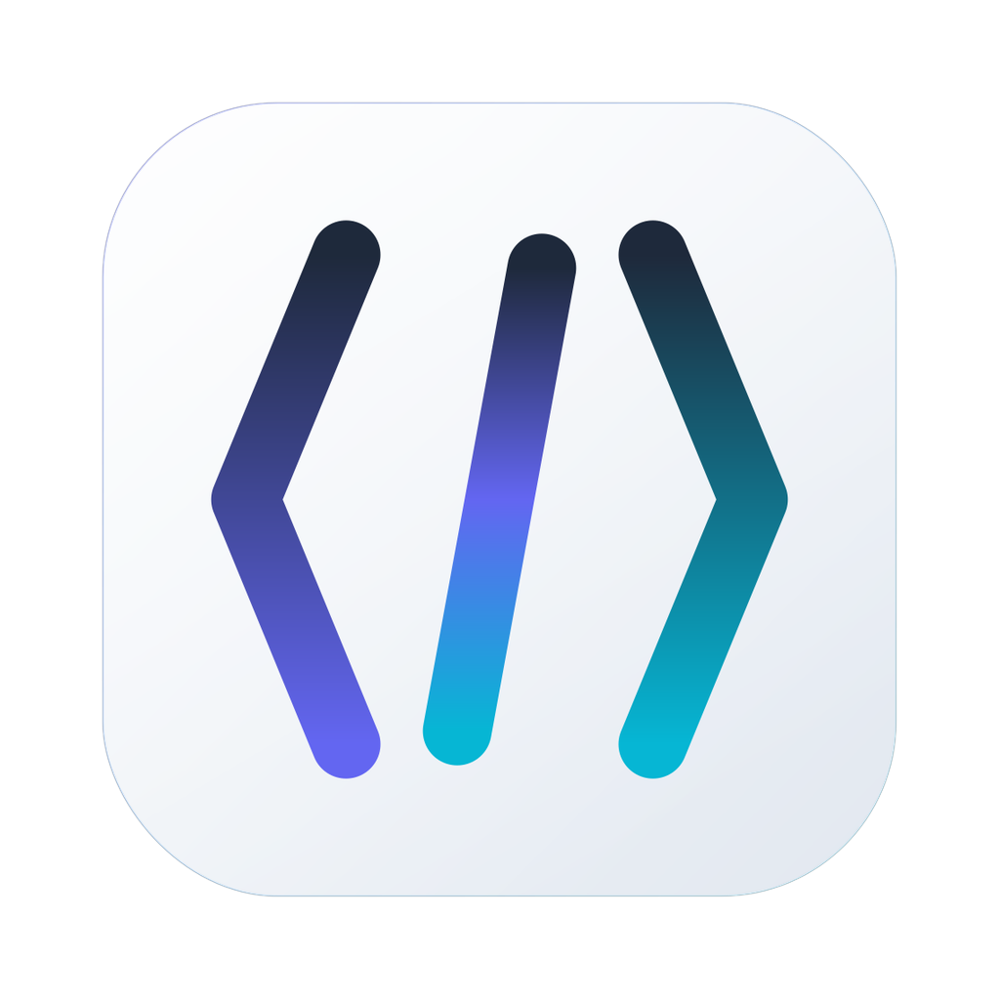

<p align="center">
  
</p>

<h1 align="center">Clauge</h1>

<p align="center">
  A lightweight, native macOS app for running multiple Claude Code sessions side by side — with purpose-driven workflows, embedded terminal, and automatic session isolation.
</p>

<p align="center">
  <a href="https://github.com/ansxuman/Clauge/blob/main/LICENSE"></a>
  <a href="https://github.com/ansxuman/Clauge/stargazers"></a>
  <a href="https://github.com/ansxuman/Clauge/issues"></a>
  <a href="https://github.com/ansxuman/Clauge/releases/latest"></a>
</p>

<p align="center">
  <a href="https://github.com/ansxuman/Clauge/issues">Report Bug</a> ·
  <a href="https://github.com/ansxuman/Clauge/issues">Request Feature</a> ·
  <a href="https://buymeacoffee.com/ansxuman">Buy me a coffee</a>
</p>

---

## Why Clauge?

Claude Code's `--resume` expects you to remember UUID session IDs. When you're juggling brainstorming, development, and code review across multiple projects, that falls apart fast.

Clauge gives every session a name, a purpose, and its own terminal — all inside a single native app that weighs under 10MB and barely touches your CPU.

## What it does

### Purpose-driven sessions
Pick a purpose when you create a session — **Brainstorming**, **Development**, **Code Review**, or **Debugging**. Clauge writes a `CLAUDE.md` file with tailored instructions so Claude stays in the right mindset throughout the session. Not a one-time prompt — it persists on every turn.

### Run sessions in parallel
Open multiple sessions for the same project without worrying about file conflicts. Clauge automatically creates **git worktrees** to isolate each session. First session runs in your project directory, second gets its own branch and working copy.

### Embedded terminal
Full interactive terminal (xterm.js + PTY) built into the app. Colors, scrollback, resize — everything works. Switch between sessions instantly without re-spawning Claude.

### Lightweight and native
Built with **Rust + Tauri**. ~10MB app size. Uses macOS native APIs — translucent vibrancy sidebar, system tray with usage stats, hidden titlebar with traffic lights. Runs with minimal memory and CPU compared to Electron alternatives.

### Usage tracking
See your Claude session and weekly usage limits right in the menu bar. Pulls real data from the Claude API — no guessing how much headroom you have left.

### Organize everything
Sessions grouped by project with expand/collapse. Auto-discovers existing Claude Code sessions from `~/.claude/projects/`. Dark and light themes with accent colors. Keyboard shortcuts for everything.

## Download

<a href="https://github.com/ansxuman/Clauge/releases/latest"><strong>Download for macOS →</strong></a>

## Development

**Requires:** [Bun](https://bun.sh), [Rust](https://rustup.rs) 1.77+, [Tauri CLI](https://tauri.app) v2

```bash
git clone https://github.com/ansxuman/Clauge.git
cd Clauge
bun install
bun run tauri dev
```

## Tech Stack

| | |
|---|---|
| **Frontend** | SvelteKit, Svelte 5 |
| **Backend** | Rust, Tauri v2 |
| **Terminal** | xterm.js, portable-pty |
| **Session isolation** | git worktrees |
| **Usage API** | Swift (NSURLSession) |

## Contributing

See [CONTRIBUTING.md](.github/CONTRIBUTING.md).

## License

[Apache License 2.0](LICENSE)
